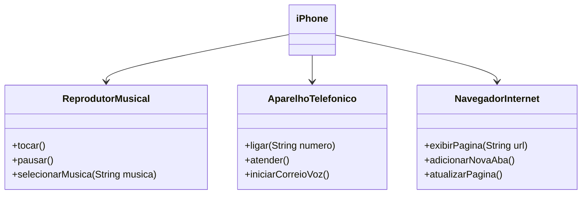

# Challenge Iphone

## Instruções

1. Assista ao vídeo do lançamento do iPhone para entender as funcionalidades principais.
2. Utilize uma ferramenta UML de sua preferência para criar o diagrama das classes e interfaces.
3. Opcionalmente, caso esteja cheio(a) de confiança, pode implementar as classes Java representadas em seu diagrama UML.
4. Submeta seu repositório GitHub conforme as orientações da plataforma DIO.

## UML

